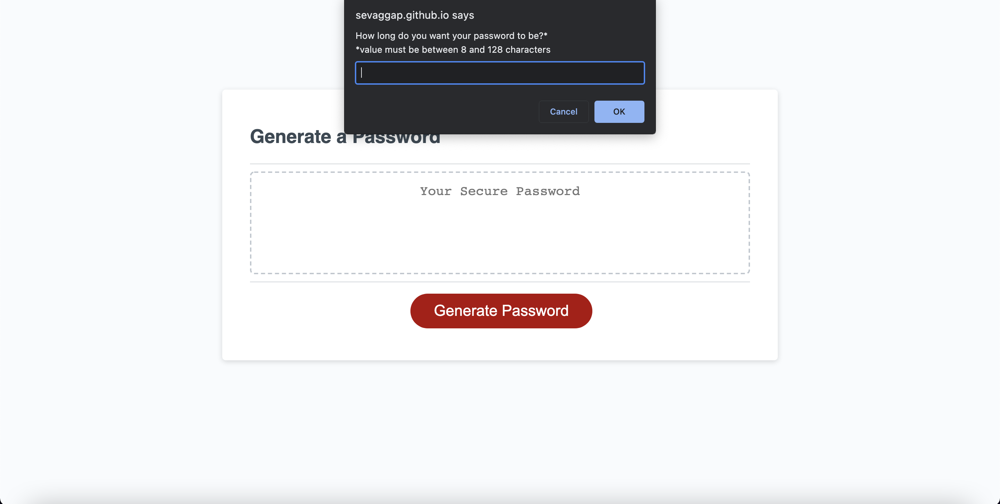
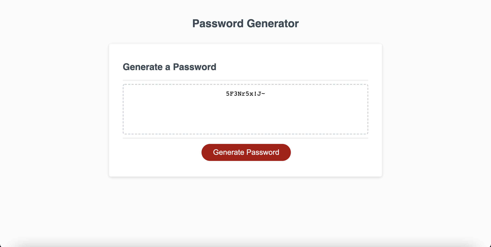

# UofT-SCS-Coding-Bootcamp-Homework-3-Password-Generator
## Description

The purpose of this project was to create an application that enables employees to generate random passwords based on criteria that they've selected. The user had to specify the length of the password and whether or not to include the following criteria: lowercase letters, uppercase letters, numbers, and special characters. There were multiple ways to do this project, and I opted to use arrays to store values and Math.random to generate random values from those arrays.

## Installation
 Download the repository and open the index.html. Be sure to download all the files as the javascript will not load if not included in the directory.

## Usage
The following images show the web application's appearance and functionality.

On load the website should appear as the following:

On click of the Generate Password button, the prompts should display as follows:

Once the password is generated, it should appear in the text box as so:

## Credits
Uoft SCS Coding Bootcamp Gitlab

## License
Copyright [2021] [Sevag Gaprielian]

Licensed under the Apache License, Version 2.0 (the "License"); you may not use this file except in compliance with the License.
You may obtain a copy of the License at http://www.apache.org/licenses/LICENSE-2.0.

Unless required by applicable law or agreed to in writing, software
distributed under the License is distributed on an "AS IS" BASIS,
WITHOUT WARRANTIES OR CONDITIONS OF ANY KIND, either express or implied.
See the License for the specific language governing permissions and
limitations under the License.

## GitHub and Link to Deployed Application
Github: sevaggap
 
Application: https://sevaggap.github.io/UofT-SCS-Coding-Bootcamp-Homework-3-Password-Generator/
